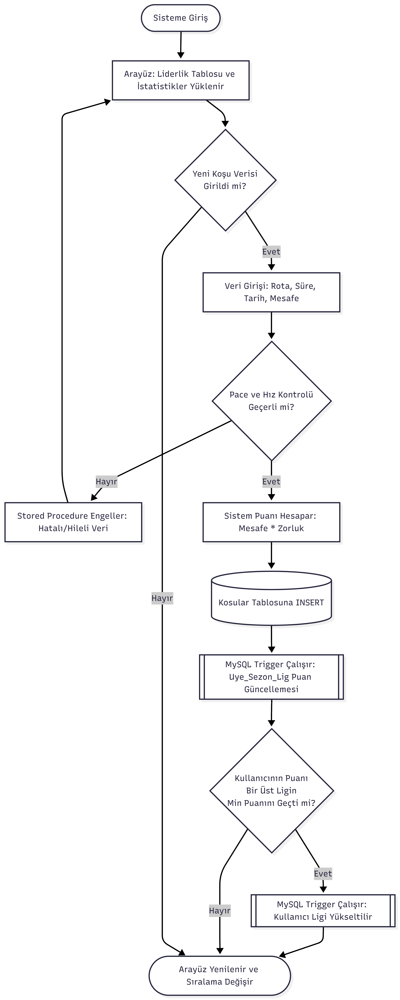
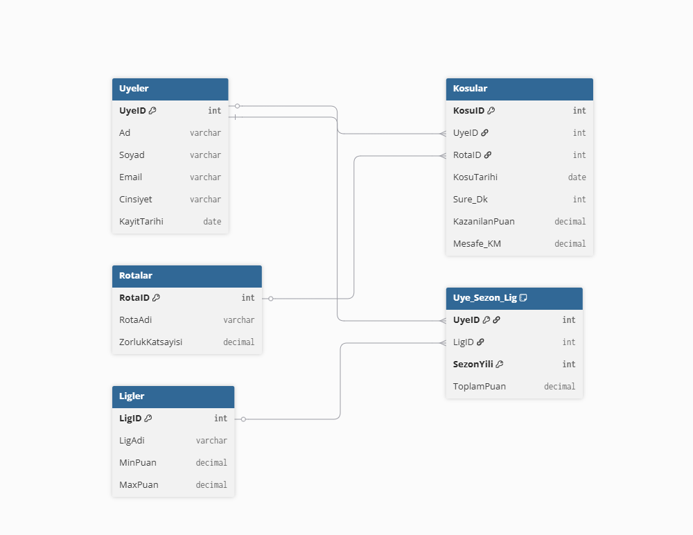

# 🏃‍♂️ Koşu Kulübü Ligi - Veritabanı Yönetim Sistemleri Projesi

## 📌 Problem Tanımı
Spor kulüplerinde üyelerin koşu performanslarının takibi, adil bir puanlama sisteminin olmaması ve üyeler arası rekabetin (lig sistemi) yönetilememesi büyük bir problemdir. Bu proje, üyelerin koştukları mesafe ve rotanın zorluk derecesine göre otomatik puan kazandığı, hileli veri girişlerinin engellendiği ve lig düşme/çıkma dinamiklerinin veritabanı seviyesinde yönetildiği bir sistem sunarak bu problemi çözmektedir.

## 🔍 Yapılan Araştırmalar
* Geliştirme aşamasında veritabanı normalizasyon kuralları (5NF) araştırılarak veri tekrarı önlenmiştir.
* Çoktan-çoka (Many-to-Many) ilişkileri çözmek için köprü tablolar (Uye_Sezon_Lig) tasarlanmıştır.
* Dünya rekoru hızlarından daha düşük pace (dk/km) değerlerinin sisteme girilmesini engellemek için Stored Procedure tabanlı hile koruma mantığı araştırılıp entegre edilmiştir.

## 🔄 Akış Şeması
*(Enes buraya draw.io ile çizeceği uygulamanın çalışma mantığını gösteren bir resim ekleyecek)*

## 🏗️ Yazılım Mimarisi
Proje, veri tabanı merkezli bir mimariyle geliştirilmiştir:
* **Veritabanı:** MySQL (Kısıtlayıcılar, Trigger, View ve Procedure'ler ile iş mantığı burada kurgulanmıştır).
* **Arayüz (Frontend):** Python & Streamlit (Hızlı ve interaktif veri görselleştirme).
* **Bağlantı Katmanı:** `mysql-connector-python` ve ortam güvenliği için `python-dotenv`.

## 🗄️ Veri Tabanı Diyagramı (ER)
*(Enes buraya veritabanındaki 5 tablonun bağlantısını gösteren ER diyagramı resmini ekleyecek)*

## 🖥️ Genel Yapı ve Arayüz Görselleri
Sistem ayağa kaldırıldığında kullanıcıları şık bir Liderlik Tablosu ve interaktif Rota İstatistikleri ekranı karşılar. Kullanıcıların lig durumları, toplam puanları ve koşulan mesafeler anlık olarak veritabanından çekilerek hesaplanır.
*(Enes buraya uygulamanızın çalışan halinin 1-2 ekran görüntüsünü ekleyecek)*

## 📚 Referanslar
1. Kocaeli Üniversitesi TBL331 Ders Notları
2. MySQL Documentation (Trigger ve Procedure Yapıları)
3. Streamlit Official Reference