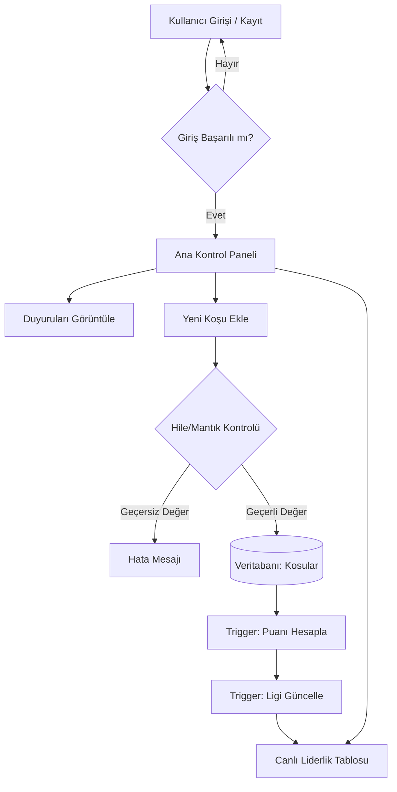

# 🏃‍♂️ Koşu Kulübü: Liderlik ve Takip Sistemi (KosuKulubuDB)

**Kocaeli Üniversitesi - Bilişim Sistemleri Mühendisliği Bölümü**
**TBL331: Veritabanı Yönetim Sistemleri - 2025-2026 Bahar Dönemi Projesi**

**Proje Ekibi:**
* Rıdvan Elen
* Muhammed Enes Omar

---

## 🎯 1. Problem Tanımı
Günümüzde spor kulüplerinde ve amatör koşu gruplarında üyelerin performans takibi, koşulan rotaların zorluk derecelerine göre adil bir şekilde puanlanması ve üyeler arası motivasyonun (rekabetin) canlı tutulması büyük bir problemdir. Mevcut sistemlerin karmaşık olması veya sadece bireysel takibe odaklanması, kulüp içi etkileşimi düşürmektedir. Bu proje; koşucuların verilerini merkezi bir veritabanında toplayarak, zorluk katsayılarına göre adil puanlama yapan ve üyeleri "Oyunlaştırma (Gamification)" mantığıyla farklı liglere yerleştiren dinamik bir rekabet ortamı yaratmayı hedefleyerek bu problemi çözmektedir.

## 🔍 2. Yapılan Araştırmalar
* **Oyunlaştırma ve Motivasyon:** Kullanıcıların spora devamlılığını sağlamak amacıyla e-spor ve mobil oyunlardaki "Lig (Bronz, Gümüş, Altın vb.)" sistemleri incelenmiş ve projeye entegre edilmiştir.
* **Adil Puanlama Algoritmaları:** Sadece mesafenin değil, rotanın coğrafi zorluğunun da (Zorluk Katsayısı) puana etki etmesi gerektiği araştırılmış ve puanlama formülü (`Mesafe * 10 * Zorluk`) geliştirilmiştir.
* **Hızlı ve Modern Arayüz Geliştirme:** Projenin kullanıcı arayüzü için Python tabanlı Streamlit kütüphanesi araştırılmış; veri görselleştirme ve veritabanı entegrasyonu açısından en verimli araç olduğuna karar verilmiştir.
* **Veri Bütünlüğü ve Güvenlik:** İmkansız hızlarda girilen koşu kayıtlarını (hileleri) engellemek adına veritabanı seviyesinde `CHECK` kısıtlamaları ve Stored Procedure içi kontroller araştırılıp uygulanmıştır.

## 🔄 3. Akış Şeması
*Uygulamanın temel işleyiş mantığı aşağıdaki akış şemasında gösterilmiştir:*

## 🏗️ 4. Yazılım Mimarisi
Proje, İstemci-Sunucu (Client-Server) mimarisine benzer bir yapıda, "Veri Katmanı" ve "Sunum Katmanı" olarak iki ana bileşenden oluşmaktadır:
* **Sunum Katmanı (Frontend):** Python ve Streamlit kullanılarak geliştirilmiştir. Özel CSS enjekte edilerek modern ve aydınlık bir arayüz (UI) tasarlanmıştır.
* **Veri Katmanı (Backend & Database):** MySQL kullanılmıştır. İş mantığının (Business Logic) büyük bir kısmı arayüzde değil, doğrudan veritabanı katmanında (Trigger, View ve Stored Procedure'ler aracılığıyla) işlenerek sistem performansı artırılmıştır.
* **Bağlantı:** `mysql-connector-python` kütüphanesi ile arayüz ve veritabanı arası iletişim sağlanmıştır.

## 📊 5. Veritabanı Diyagramı (ER)
Veritabanımız, 5N (Normalizasyon) kurallarına uygun olarak tasarlanmış olup, toplam 6 adet birbiriyle ilişkili (Primary/Foreign Key) tablodan oluşmaktadır.

## 🏢 6. Genel Yapı
Proje; üyelerin kayıt olup sisteme giriş yapabildiği, adminlerin sistem üzerinden duyuru paylaşabildiği ve üyelerin koşularını rotalara göre kaydedebildiği bir ekosistemdir. Sistemde;
* **Trigger'lar** ile puanlamalar ve küme düşme/çıkma işlemleri otomatik hesaplanır.
* **View'lar** aracılığıyla Canlı Liderlik Tablosu ve Rota Tercih İstatistikleri anlık olarak çekilir.
* **Stored Procedure'ler** ile karmaşık koşu ekleme ve ceza puanı kesme işlemleri güvenli bir şekilde yürütülür.
* **Kısıtlayıcılar (Constraints)** sayesinde hatalı, eksik veya tekrarlayan veri girişi engellenir.

## 📚 7. Referanslar
1. Kocaeli Üniversitesi TBL331 Ders Notları
2. [MySQL 8.0 Reference Manual](https://dev.mysql.com/doc/refman/8.0/en/) - Trigger ve Procedure yapıları için.
3. [Streamlit Documentation](https://docs.streamlit.io/) - Arayüz ve modern CSS entegrasyonları için.
4. [Mermaid.js](https://mermaid.js.org/) - Akış şeması tasarımı için.
